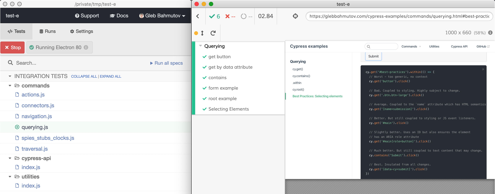

# @bahmutov/cypress-examples [](https://dashboard.cypress.io/projects/dis6wg/runs)

[![ci status][ci image]][ci url] [![prettier status][prettier image]][prettier url] [![deployed status][deployed image]][deployed url] [](https://github.com/bahmutov/cypress-examples/actions/workflows/scrape.yml) [![renovate-app badge][renovate-badge]][renovate-app] 

> Static site with Cypress examples tested right from the Markdown sources

Live site [glebbahmutov.com/cypress-examples/](https://glebbahmutov.com/cypress-examples/)

## Benefits

- single source of truth for tests and HTML pages. No more copy / pasting
  - Cypress runs tests using Markdown source files via [cypress-markdown-preprocessor](https://github.com/bahmutov/cypress-markdown-preprocessor) and [cypress-fiddle](https://github.com/cypress-io/cypress-fiddle)
- great development experience with live reload and optimized static build thanks to [Vuepress][vuepress] and Prettier formatting
- excellent text and code comment search thanks to Algolia
  - [Scrape Static Site with Algolia](https://glebbahmutov.com/blog/scrape-static-site-with-algolia/) blog post
  - scrape happens after deploying the docs to GitHub Pages in [.github/workflows/deployed.yml](.github/workflows/deployed.yml) workflow
- recipes that are not included in the NPM package but deployed to the static pages

## Blog posts

The following blog posts explain how I write Cypress demo tests using Markdown in this repository

- [Run End-to-end Tests from Markdown Files](https://glebbahmutov.com/blog/cypress-fiddle/)
- [Write Cypress Markdown Preprocessor](https://glebbahmutov.com/blog/write-cypress-preprocessor/)

You can see the [cypress.config.js](./cypress.config.js) and [plugins.js](./plugins.js) to learn how [cypress-markdown-preprocessor](https://github.com/bahmutov/cypress-markdown-preprocessor) is set tup.

## Notes

- use "function" syntax in `<script>` tags that need to be live, otherwise Markdown escapes `=>` arrows?!
- if the HTML block includes the `<style>` section, put it at the start of the block, otherwise it might get lost

## Try published specs

You can run the exported spec files.

- Start a new project or use an existing project, and add this module as a dev dependency

```shell
$ npm i -D @bahmutov/cypress-examples
```

- Open or run Cypress and point at the folder inside `node_modules`

```shell
$ npx cypress open --project node_modules/\@bahmutov/cypress-examples/
```



## Development

There is a difference between running Markdown files and testing fully exported specs against the built site. To do this all in a single command locally run

```
npm run dev:export
```

This command builds the static site, exports the Markdown specs into JavaScript specs, starts local server, and when it responds, starts Cypress.

You can also export all Markdown files into JavaScript, run them locally, and run all E2E tests using the JS specs with:

```
npm run run:exported
```

## Small print

Copyright © 2025 Gleb Bahmutov

License: private code. Absolutely no permission to copy the source code or train AI/LLM models without explicit prior authorization. No scraping of this content or its pages for retrieval systems. No using this content for answering queries or any other retrieval.

[ci image]: https://github.com/bahmutov/cypress-examples/workflows/ci/badge.svg?branch=master
[ci url]: https://github.com/bahmutov/cypress-examples/actions?query=workflow%3Aci
[prettier image]: https://github.com/bahmutov/cypress-examples/workflows/prettier/badge.svg?branch=master
[prettier url]: https://github.com/bahmutov/cypress-examples/actions?query=workflow%3Aprettier
[deployed image]: https://github.com/bahmutov/cypress-examples/workflows/deployed/badge.svg?branch=master
[deployed url]: https://github.com/bahmutov/cypress-examples/actions?query=workflow%3Adeployed
[vuepress]: https://vuepress.vuejs.org/
[renovate-badge]: https://img.shields.io/badge/renovate-app-blue.svg
[renovate-app]: https://github.com/renovatebot/renovate
