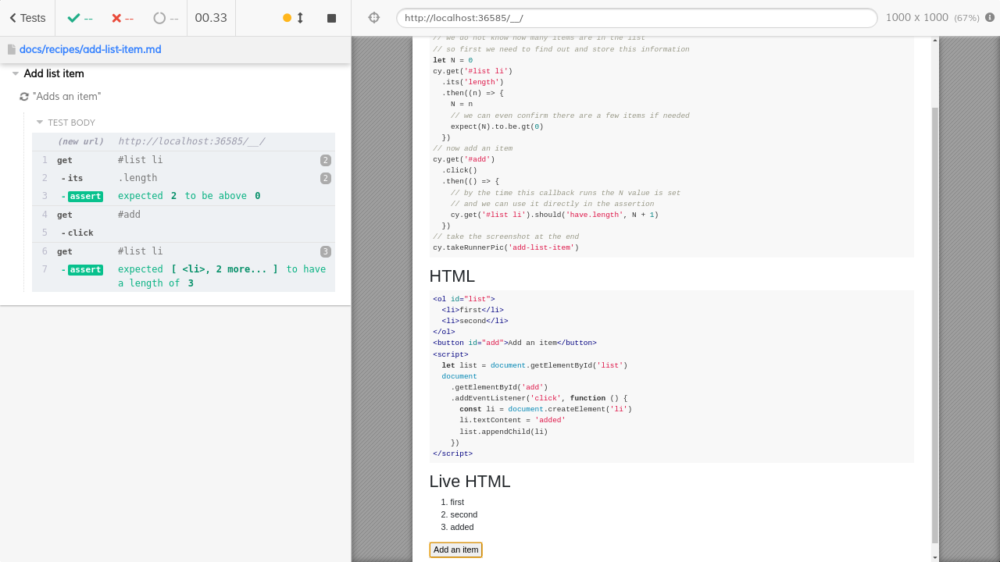

# Add list item

In this example, we do not know how many items are in the list initially. After clicking a button we want to confirm that the list has increased by one item.

<!-- fiddle "Adds an item" -->

```html
<ol id="list">
  <li>first</li>
  <li>second</li>
</ol>
<button id="add">Add an item</button>
<script>
  let list = document.getElementById('list')
  document
    .getElementById('add')
    .addEventListener('click', function () {
      const li = document.createElement('li')
      li.textContent = 'added'
      list.appendChild(li)
    })
</script>
```

```js
// we do not know how many items are in the list
// so first we need to find out and store this information
let N = 0
cy.get('#list li')
  .its('length')
  .then((n) => {
    N = n
    // we can even confirm there are a few items if needed
    expect(N).to.be.gt(0)
  })
// now add an item
cy.get('#add')
  .click()
  .then(() => {
    // by the time this callback runs the N value is set
    // and we can use it directly in the assertion
    cy.get('#list li').should('have.length', N + 1)
  })
// take the screenshot at the end
cy.takeRunnerPic('add-list-item')
```

<!-- fiddle-end -->



## Delete list item

<!-- fiddle "Delete list item" -->

```html
<ol id="list">
  <li>first</li>
  <li>second</li>
  <li>third</li>
</ol>
<button id="del">Delete a list item</button>
<script>
  let list2 = document.getElementById('list')
  document
    .getElementById('del')
    .addEventListener('click', function () {
      // simulate an application with random delay
      setTimeout(() => {
        list2.children[0].remove()
      }, Math.random() * 1000 + 1500)
    })
</script>
```

```js
// first, get the number of elements currently in the list
cy.get('#list li')
  // by adding an assertion like this
  // we support an empty initial list without any items
  .should('have.length.gte', 0)
  .its('length')
  .then((N) => {
    // if N is zero, nothing to delete
    if (N === 0) {
      return
    }
    // delete one element
    cy.get('#del').click()
    // fetch the list items; there should be N - 1 items
    cy.get('#list li').should('have.length', N - 1)
  })
```

<!-- fiddle-end -->
