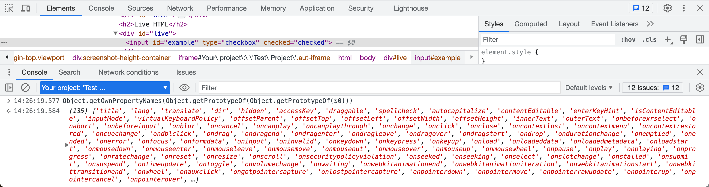
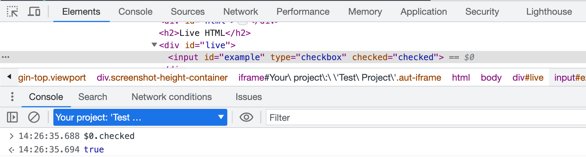

# Attributes Vs Properties

Sometimes I use `cy.get('...').should('have.attr', '...')` and sometimes I use `cy.get('...').should('have.prop', '...')`. Similarly, sometimes I invoke the jQuery method [attr](https://api.jquery.com/attr/) via `cy.get('...').invoke('attr', '...')` and sometimes I invoke the [prop](https://api.jquery.com/prop/) method like `cy.get('...').invoke('prop', '...')`.

What is the difference?

📺 Watch this recipe explained in the video [Attributes Vs Properties](https://youtu.be/48fmryvaTNE).

An HTML element on the page has _attributes_ which are always string values:

<!-- fiddle Attributes vs properties -->

```html
<input id="example" type="checkbox" checked="checked" />
```

The above element has the following HTML attributes: `id`, `type`, and `checked`. We can confirm each declared attribute using the `have.attr` assertion.

```js
cy.get('#example')
  .should('have.attr', 'id', 'example')
  .and('have.attr', 'type', 'checkbox')
  .and('have.attr', 'checked', 'checked')
```

We could get the attribute string value by calling the jQuery `attr` method. Since it yields the attribute value, we need to query the DOM again if we need to confirm more attributes.

```js
cy.log('**invoke attr method**')
cy.get('#example')
  .invoke('attr', 'id')
  .should('equal', 'example')
cy.get('#example')
  .invoke('attr', 'type')
  .should('equal', 'checkbox')
cy.get('#example')
  .invoke('attr', 'checked')
  .should('equal', 'checked')
```

**Tip:** assertion `have.attr` with just the name of the attribute yields the value of the attribute. The above code could be rewritten as

```js
cy.log('**have.attr assertion**')
cy.get('#example')
  .should('have.attr', 'id')
  .should('equal', 'example')
cy.get('#example')
  .should('have.attr', 'type')
  .should('equal', 'checkbox')
cy.get('#example')
  .should('have.attr', 'checked')
  .should('equal', 'checked')
```

The browser reads the HTML and converts each declared HTML element into an object. This object has links to its parent, any children, and _lots_ of other DOM properties. Let's see their names (most of them come from the prototype chain)



The properties have everything needed by the browser at runtime. For example, the HTML attribute `checked="checked"` becomes the Boolean property `checked`



To retrieve the runtime element properties I use the jQuery `prop` method and Chai-Jquery assertion `have.prop`. For example, we can check if the input checkbox element is currently checked:

```js
cy.get('#example').should('have.prop', 'checked', true)
// equivalent
cy.get('#example').invoke('prop', 'checked').should('be.true')
```

**Tip:** I personally like the `have.prop` assertion since it shows the property _name_ in the Command Log, while the `cy.invoke` does not.


<!-- fiddle-end -->

## See also

- [`.prop() vs .attr()`](https://stackoverflow.com/questions/5874652/prop-vs-attr)
- [Attributes are equal](./attributes-are-equal.md)
- [Element Attributes](./element-attributes.md)
