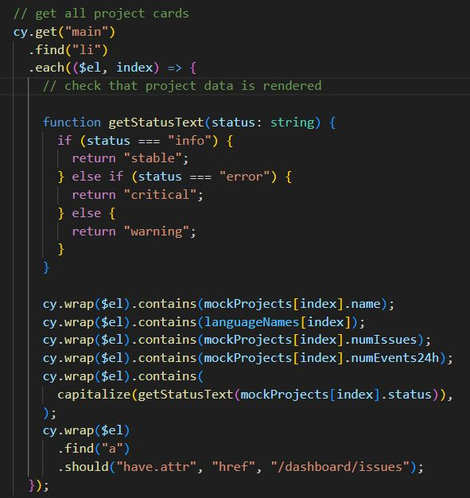

# Check Cards

This example comes from [this example post](https://www.linkedin.com/posts/keith-petryshyn_soloproject-webdeveloper-opentowork-activity-7124944500061335553-nOn3/). Here is the initial code screenshot as posted



Let's refactor this code to make it:

- simpler
- correct

📺 You can watch the refactoring in the video [Check Cards Test Refactoring](https://youtu.be/lWWzQFt-0BI).

## Step 1 initial code

<!-- fiddle Check cards: initial code -->

```html hide
<main>
  <ul>
    <li>
      <h2>Project A</h2>
      <div>10 issues</div>
      <div>4 events in the last 24 hours</div>
      <div>stable</div>
      <a href="/dashboard/issues">issues</a>
    </li>
    <li>
      <h2>Project B</h2>
      <div>10 issues</div>
      <div>1 event in the last 24 hours</div>
      <div>error</div>
      <a href="/dashboard/issues">issues</a>
    </li>
    <li>
      <h2>Project C</h2>
      <div>100 issues</div>
      <div>10 events in the last 24 hours</div>
      <div>critical</div>
      <a href="/dashboard/issues">issues</a>
    </li>
  </ul>
</main>
```

```js hide
const mockProjects = [
  {
    name: 'Project A',
    numIssues: 10,
    numEvents24h: 4,
    status: 'stable',
  },
  {
    name: 'Project B',
    numIssues: 10,
    numEvents24h: 4,
    status: 'error',
  },
  {
    name: 'Project C',
    numIssues: 10,
    numEvents24h: 10,
    status: 'critical',
  },
]
```

```js
cy.get('main')
  .find('li')
  .each(($el, index) => {
    cy.wrap($el).contains(mockProjects[index].name)
    cy.wrap($el).contains(mockProjects[index].numIssues)
    cy.wrap($el).contains(mockProjects[index].numEvents24h)
    cy.wrap($el).contains(mockProjects[index].status)
    cy.wrap($el)
      .find('a')
      .should('have.attr', 'href', '/dashboard/issues')
  })
```

<!-- fiddle-end -->

Have you noticed any problems with the code above? Does it correctly verify the cards for each project? I see some problems...

## Step 2 shorted the code

Let's refactor the test code to make it shorter and more elegant, while preserving its behavior.

<!-- fiddle Check cards: shorter code -->

```html hide
<main>
  <ul>
    <li>
      <h2>Project A</h2>
      <div>10 issues</div>
      <div>4 events in the last 24 hours</div>
      <div>stable</div>
      <a href="/dashboard/issues">issues</a>
    </li>
    <li>
      <h2>Project B</h2>
      <div>10 issues</div>
      <div>1 event in the last 24 hours</div>
      <div>error</div>
      <a href="/dashboard/issues">issues</a>
    </li>
    <li>
      <h2>Project C</h2>
      <div>100 issues</div>
      <div>10 events in the last 24 hours</div>
      <div>critical</div>
      <a href="/dashboard/issues">issues</a>
    </li>
  </ul>
</main>
```

```js hide
const mockProjects = [
  {
    name: 'Project A',
    numIssues: 10,
    numEvents24h: 4,
    status: 'stable',
  },
  {
    name: 'Project B',
    numIssues: 10,
    numEvents24h: 4,
    status: 'error',
  },
  {
    name: 'Project C',
    numIssues: 10,
    numEvents24h: 10,
    status: 'critical',
  },
]
```

```js
cy.get('main')
  .find('li')
  .each(($el, index) => {
    const { name, numIssues, numEvents24h, status } =
      mockProjects[index]

    expect($el)
      .to.include.text(name)
      .and.to.include.text(numIssues)
      .and.to.include.text(numEvents24h)
      .and.to.include.text(status)

    cy.wrap($el).find('a[href="/dashboard/issues"]')
  })
```

Or we can use [cy.within](https://on.cypress.io/within) command

```js
cy.get('main')
  .find('li')
  .each(($el, index) => {
    const { name, numIssues, numEvents24h, status } =
      mockProjects[index]

    cy.wrap($el).within(() => {
      cy.contains(name)
      cy.contains(numIssues)
      cy.contains(numEvents24h)
      cy.contains(status)
      cy.get('a[href="/dashboard/issues"]')
    })
  })
```

<!-- fiddle-end -->

There are still problems with the code above. Notice it finds incorrect elements using partial text match. For example, the second card should have 4 issues according to the data object `mockProjects[1]`. But instead it finds the digit `4` in the wrong message `1 event in the last 24 hours` on the page.

## Step 3 use precise selectors

To avoid matching text accidentally, I prefer using `cy.contains(selector, text)` command rather than `cy.contains(text)`. This will catch accidental partial text matches like `10` inside `100` or `4` inside `24 hours`.

<!-- fiddle Check cards: use precise selectors -->

```html hide
<main>
  <ul>
    <li class="card">
      <h2 data-cy="name">Project A</h2>
      <div data-cy="issues">10 issues</div>
      <div>
        <span data-cy="24h">4</span> events in the last 24 hours
      </div>
      <div data-cy="status">stable</div>
      <a href="/dashboard/issues">issues</a>
    </li>
    <li class="card">
      <h2 data-cy="name">Project B</h2>
      <div data-cy="issues">10 issues</div>
      <div>
        <span data-cy="24h">1</span> event in the last 24 hours
      </div>
      <div data-cy="status">error</div>
      <a href="/dashboard/issues">issues</a>
    </li>
    <li class="card">
      <h2 data-cy="name">Project C</h2>
      <div data-cy="issues">100 issues</div>
      <div>
        <span data-cy="24h">10</span> events in the last 24 hours
      </div>
      <div data-cy="status">critical</div>
      <a href="/dashboard/issues">issues</a>
    </li>
  </ul>
</main>
```

```js hide
const mockProjects = [
  {
    name: 'Project A',
    numIssues: 10,
    numEvents24h: 4,
    status: 'stable',
  },
  {
    name: 'Project B',
    numIssues: 10,
    numEvents24h: 1,
    status: 'error',
  },
  {
    name: 'Project C',
    numIssues: 100,
    numEvents24h: 10,
    status: 'critical',
  },
]
```

```js
cy.get('main li.card').each(($el, index) => {
  cy.log(`checking card **${index + 1}**`)
  const { name, numIssues, numEvents24h, status } =
    mockProjects[index]

  cy.wrap($el).within(() => {
    cy.contains('[data-cy=name]', name)
    cy.contains('[data-cy=issues]', `${numIssues} issues`)
    cy.contains('[data-cy=24h]', numEvents24h)
    cy.contains('[data-cy=status]', status)
    cy.contains('a[href="/dashboard/issues"]', 'issues')
  })
})
```

<!-- fiddle-end -->

## Step 4 go from data to UI

Finally, we need to fix the main problem with the code above. As written, the test takes whatever the application shows on the page and checks it against the data. This _assumes_ the page can be trusted to show something. But what if the application is completely broken and renders zero `li.card` items? Or just the first one? You will never catch the problem, since you don't find elements to check! You should always take the data as the source of truth and then check the page to see if it correctly redners it.

<!-- fiddle Check cards: go from data to UI -->

```html hide
<main>
  <ul>
    <li class="card">
      <h2 data-cy="name">Project A</h2>
      <div data-cy="issues">10 issues</div>
      <div>
        <span data-cy="24h">4</span> events in the last 24 hours
      </div>
      <div data-cy="status">stable</div>
      <a href="/dashboard/issues">issues</a>
    </li>
    <li class="card">
      <h2 data-cy="name">Project B</h2>
      <div data-cy="issues">10 issues</div>
      <div>
        <span data-cy="24h">1</span> event in the last 24 hours
      </div>
      <div data-cy="status">error</div>
      <a href="/dashboard/issues">issues</a>
    </li>
    <li class="card">
      <h2 data-cy="name">Project C</h2>
      <div data-cy="issues">100 issues</div>
      <div>
        <span data-cy="24h">10</span> events in the last 24 hours
      </div>
      <div data-cy="status">critical</div>
      <a href="/dashboard/issues">issues</a>
    </li>
  </ul>
</main>
```

```js hide
const mockProjects = [
  {
    name: 'Project A',
    numIssues: 10,
    numEvents24h: 4,
    status: 'stable',
  },
  {
    name: 'Project B',
    numIssues: 10,
    numEvents24h: 1,
    status: 'error',
  },
  {
    name: 'Project C',
    numIssues: 100,
    numEvents24h: 10,
    status: 'critical',
  },
]
```

```js
// confirm the correct number of items is shown
cy.get('main li.card').should('have.length', mockProjects.length)
// iterate over the data to confirm the info
// for each card is shown correctly
mockProjects.forEach((project, index) => {
  const { name, numIssues, numEvents24h, status } = project
  cy.get('main li.card')
    .eq(index)
    .within(() => {
      cy.contains('[data-cy=name]', name)
      cy.contains('[data-cy=issues]', `${numIssues} issues`)
      cy.contains('[data-cy=24h]', numEvents24h)
      cy.contains('[data-cy=status]', status)
      cy.contains('a[href="/dashboard/issues"]', 'issues')
    })
})
```

<!-- fiddle-end -->

## See also

- [How I Add Test Ids To Front-End Components](https://glebbahmutov.com/blog/how-i-add-test-ids/)
