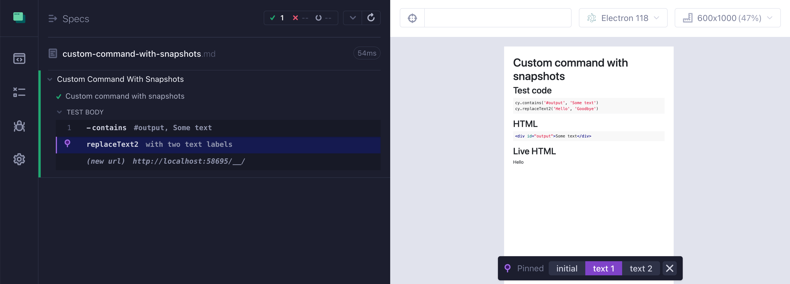

# Custom Command With Snapshots

📺 Watch this recipe explained in the video [Cypress Custom Commands With Multiple DOM Snapshots](https://youtu.be/TxCB1QDw6qY).

<!-- fiddle Custom command with snapshots -->

```html
<div id="output">Some text</div>
```

Let's define a custom command that replaces the text inside the "#output" element. We are not going to simply replace the text, but instead we will replace it twice. We need to see how the element looks after _each_ replacement. Thus our command needs multiple DOM snapshots to see each replacement.

```js hide
Cypress.Commands.add('replaceText2', (text1, text2) => {
  const log = Cypress.log({
    autoEnd: false,
    message: 'with two text labels',
  }).snapshot('initial')

  // step 1: replace the text
  cy.get('#output', { log: false })
    .invoke({ log: false }, 'text', text1)
    .then(() => {
      // log.snapshot is a synchronous command
      // so we want to run it AFTER cy.invoke has finished
      // that's why it is inside cy.then callback
      log.snapshot('text 1')
    })

  // step 2: replace the text again
  cy.get('#output', { log: false })
    .invoke({ log: false }, 'text', text2)
    .then(() => {
      log.snapshot('text 2').end()
    })
})
```

Let's try it out.

```js
cy.contains('#output', 'Some text')
cy.replaceText2('Hello', 'Goodbye')
```

Great, if you pin the "replaceText2" command, you should see multiple DOM snapshot selector. Clicking on the "text 1" label restores the DOM after the element "#output" receives the text label "Hello".



<!-- fiddle-end -->
