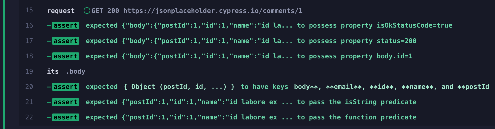

# Don't Change The Subject

📺 You can watch this recipe explained in the video [The Possess Assertion From cypress-map Plugin](https://youtu.be/HHxkL-BPyjA)

<!-- fiddle Checking the request object -->

Imagine we are checking the server response. There are properties at different nesting levels. We want to check:

- the status code and the `isOkStatusCode` properties
- drill into the `body` and confirm
  - the `id` value
  - the keys present in the response object
  - the `email` property is a string that includes the `@` character

We cannot simply use the `have.property` assertion, since it changes the subject

```js
const url = 'https://jsonplaceholder.cypress.io/comments/1'
cy.request(url)
  .should('have.property', 'isOkStatusCode', true)
  // oops, the subject now is just `true`
  .should('equal', true)
```

We could pass the entire subject to `cy.then(callback)` and use the explicit assertions

```js
cy.request(url)
  .then((response) => {
    expect(response).to.have.property('isOkStatusCode', true)
    expect(response).to.have.property('status', 200)
    expect(response).to.have.nested.property('body.id', 1)
  })
  // drill down into the "body"
  .its('body')
  .then((body) => {
    expect(body).to.have.keys([
      'body',
      'email',
      'id',
      'name',
      'postId',
    ])
    expect(body.email).to.satisfy(Cypress._.isString)
    expect(body.email).to.satisfy((s) => s.includes('@'))
  })
```

Ughh, so verbose! To make the assertions more elegant, we could use my plugin [cy-spok](http://github.com/bahmutov/cy-spok), but there is another way. We can use the `possess` assertion from my plugin [cypress-map](https://github.com/bahmutov/cypress-map). The main difference between `have.property` and `possess` is that the assertion `possess` does not change the current subject. **Bonus:** the assertion `possess` also supports deep properties and checking the value against the predicates.

```js
cy.request(url)
  .should('possess', 'isOkStatusCode', true)
  // yields the original subject
  // so you can continue checking
  .and('possess', 'status', 200)
  // supports the nested properties
  .and('possess', 'body.id', 1)
  // let's drill into the "body"
  .its('body')
  .should('have.keys', ['body', 'email', 'id', 'name', 'postId'])
  // you can even use predicate functions
  .and('possess', 'email', Cypress._.isString)
  .and('possess', 'email', (s) => s.includes('@'))
```

Short, expressive, and looks good in the Command Log



<!-- fiddle-end -->
