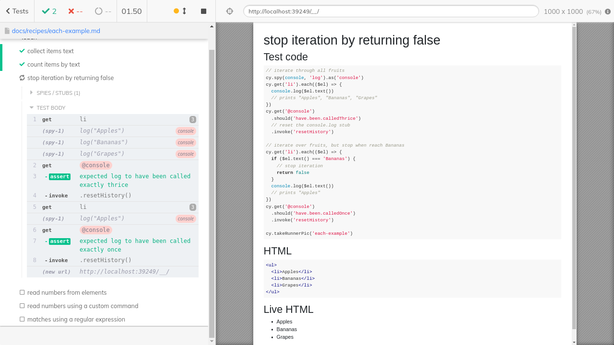
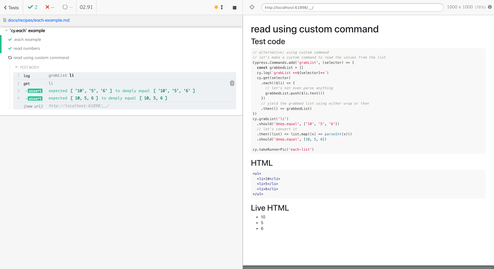

# `cy.each` examples

## Confirm each item

<!-- fiddle .each / confirm each item -->

Let's say we have a list of items

```html
<ul>
  <li class="fruit">Apples $10</li>
  <li class="fruit">Bananas $20</li>
  <li class="fruit">Grapes $15</li>
</ul>
```

Let's confirm each item starts with the fruit name

```js
cy.get('li').each(($li) => {
  // you can use Chai-jQuery assertions
  expect($li.text()).to.match(/^(Apples|Bananas|Grapes)/)
  expect($li).to.have.class('fruit')
  // you can also use cy.wrap($li) to be able to use Cypress commands
  cy.wrap($li)
    .should('have.class', 'fruit')
    .invoke('text')
    .should('match', /\$\d+$/) // ends with a price
})
```

<!-- fiddle-end -->

## Non-dom values

`cy.each` can iterate over any items from a list / jQuery object

<!-- fiddle .each / even numbers -->

```js
function isEven(n) {
  return n % 2 === 0
}
cy.wrap([4, 6, 8, 10]).each((n) =>
  expect(n, 'odd').to.satisfy(isEven),
)
```

<!-- fiddle-end -->

## Confirm prices

<!-- fiddle .each / confirm prices -->

Let's say we have a list of prices. We need to confirm that every price is higher than \$1.99

```html
<ul>
  <li class="price">$10</li>
  <li class="price">$2.50</li>
  <li class="price">$4.66</li>
  <li class="price">$2.02</li>
</ul>
```

```js
// first, confirm we have our prices
cy.get('.price')
  .should('have.length.greaterThan', 2)
  .each(($price, k) => {
    // get the text from the jQuery element
    const priceText = $price.text().trim()
    // strip '$' and convert to a number
    const price = Number(priceText.replace(/\$/g, ''))
    // confirm the price is above the min price
    expect(price, `item ${k + 1}`).to.be.above(2.0)
  })
```

<!-- fiddle-end -->

## Collect items text

<!-- fiddle .each / collect items text -->

Let's say we have a list of items

```html
<ul>
  <li>Apples</li>
  <li>Bananas</li>
  <li>Grapes</li>
</ul>
```

Let's put all list items into a list and check it.

```js
const list = []
cy.get('li')
  .each(($li) => {
    list.push($li.text())
  })
  .then(() => {
    // by the time ".each" is finished
    // the list is populated
    expect(list).to.deep.equal(['Apples', 'Bananas', 'Grapes'])
  })
```

<!-- fiddle-end -->

## Count items with matching text

<!-- fiddle .each / count items by text -->

If we have a list of items and want to count how many times the word "Apples" is in it

```html
<ul>
  <li>Apples</li>
  <li>Bananas</li>
  <li>Grapes</li>
  <li>Apples</li>
  <li>Apples</li>
  <li>Kiwi</li>
</ul>
```

We should keep the count variable outside the `.each` callback and use `.then` to compare it to the expected value.

```js
let count = 0
cy.get('li')
  .each(($li) => {
    if ($li.text() === 'Apples') {
      count += 1
    }
  })
  .then(() => {
    // by the time ".each" is finished, the count has been updated
    expect(count, 'Apples count').to.equal(3)
  })
```

We can also use the built-in jQuery `:contains(text)` selector

```js
cy.get('li:contains("Apples")').should('have.length', 3)
```

<!-- fiddle-end -->

## Stop `cy.each` iteration

The original [issue #8652](https://github.com/cypress-io/cypress/issues/8652)

<!-- fiddle .each / stop iteration by returning false -->

Let's take the list of fruits again

```html
<ul>
  <li>Apples</li>
  <li>Bananas</li>
  <li>Grapes</li>
</ul>
```

Let's print each item and then check that we have called `console.log` three times.

```js
// iterate through all fruits
cy.spy(console, 'log').as('console')
cy.get('li').each(($el) => {
  console.log($el.text())
  // prints "Apples", "Bananas", "Grapes"
})
cy.get('@console')
  .should('have.been.calledThrice')
  // reset the console.log stub
  .invoke('resetHistory')

// iterate over fruits, but stop when reach Bananas
cy.get('li').each(($el) => {
  if ($el.text() === 'Bananas') {
    // stop iteration
    return false
  }
  console.log($el.text())
  // prints "Apples"
})
cy.get('@console')
  .should('have.been.calledOnce')
  .invoke('resetHistory')

cy.takeRunnerPic('each-example')
```

<!-- fiddle-end -->



## Early stop does not change the subject

Even if you stop the iteration early by returning `false`, the original subject is still passed to the next command or assertion.

<!-- fiddle Stop the iteration does not change the subject -->

```js
const numbers = [1, 2, 3, 4]
cy.wrap(numbers)
  .each((number) => {
    // stop the iteration when we get to the number 2
    return number === 2 ? false : true
  })
  // the same original array is still passed
  // to the next assertion
  .should('equal', numbers)
```

<!-- fiddle-end -->

## How to read values from elements using `.each`?

<!-- fiddle .each / read numbers from elements -->

```html
<ul>
  <li>10</li>
  <li>5</li>
  <li>6</li>
</ul>
```

```js
const list = []
cy.get('li')
  .each(($li) => {
    list.push(parseInt($li.text()))
  })
  // by the time ".each" is finished
  // the list should have 3 numbers, let's grab it
  .wrap(list)
  .should('deep.equal', [10, 5, 6])
```

<!-- fiddle-end -->

<!-- fiddle .each / read numbers using a custom command -->

```html
<ul>
  <li>10</li>
  <li>5</li>
  <li>6</li>
</ul>
```

**alternative:** using a custom command

```js
// let's make a custom command to read the values from the list
Cypress.Commands.add('grabList', (selector) => {
  const grabbedList = []
  cy.log(`grabList **${selector}**`)
  cy.get(selector)
    .each(($li) => {
      // let's not even parse anything
      grabbedList.push($li.text())
    })
    // yield the grabbed list using either wrap or then
    .then(() => grabbedList)
})
cy.grabList('li')
  .should('deep.equal', ['10', '5', '6'])
  // let's convert it
  .then((list) => list.map((x) => parseInt(x)))
  .should('deep.equal', [10, 5, 6])

cy.takeRunnerPic('each-list')
```

<!-- fiddle-end -->



## Match regular expression with OR

Imagine we have a lit of prices, and each item can have a dollar amount or "Pay As You Want" string. Let's confirm this.

<!-- fiddle .each / matches using a regular expression -->

```html
<ul>
  <li>
    <span class="item">Apples</span>
    <span class="price">$0.99</span>
  </li>
  <li>
    <span class="item">Grapes</span>
    <span class="price">Pay As You Want</span>
  </li>
  <li>
    <span class="item">Tomatoes</span>
    <span class="price">$2.69</span>
  </li>
  <li>
    <span class="item">Lemons</span>
    <span class="price">Pay as you want</span>
  </li>
</ul>
<style>
  .price {
    font-weight: bold;
  }
</style>
```

```js
// first ensure the number of prices is the same as items
cy.get('.item')
  .should('have.length.gt', 0)
  .its('length')
  .then((n) => {
    cy.get('.price').should('have.length', n)
  })
// cy.each callback receives the jQuery element
cy.get('.price').each(($price, k) => {
  const text = $price.text()
  // find out the item name for better messaging
  const item = $price.parent().find('.item').text()
  // our regular expression should match prices
  // and the "pay as you go text" and ignore case
  const expression = /^(\$\d+\.\d\d|pay as you want)$/i
  expect(text, `${k + 1}: ${item}`).to.match(expression)
})
```

<!-- fiddle-end -->

See also [Collect Headings recipe](./collect-headings.md).

## .each callback can return a promise

You can return a promise from `each(callback)`. Cypress will wait for the promise to resolve before continuing.

<!-- fiddle Returns a promise -->

```js
let lastSeen = 0
cy.wrap([1, 2, 3, 4])
  .each((number) => {
    lastSeen = number
    // the returned promise delays each command by 1 second
    // NOTE: it does not change the yielded value,
    // the original value is yielded to the next command or assertion
    return new Promise((resolve) => {
      setTimeout(() => {
        resolve(number * 2)
      }, 1000)
    })
  })
  .should('be.an', 'array')
  // the original array is unchanged
  .should('deep.equal', [1, 2, 3, 4])
  .then(() => {
    // cy.each went through all numbers
    expect(lastSeen).to.equal(4)
  })
```

<!-- fiddle-end -->

## Cannot stop the iteration when using a Promise

If you delay the execution by returning a Promise from `cy.each(callback)`, its resolved value is ignored, and it does not stop the execution early.

<!-- fiddle Does not stop the execution -->

```js
let lastSeen = 0
cy.wrap([1, 2, 3, 4])
  .each((number) => {
    lastSeen = number
    return new Promise((resolve) => {
      setTimeout(() => {
        // try to stop early by resolved with false
        resolve(number === 2 ? false : true)
      }, 1000)
    })
  })
  .should('be.an', 'array')
  // the original array is unchanged
  .should('deep.equal', [1, 2, 3, 4])
  .then(() => {
    // cy.each still went through all numbers
    expect(lastSeen).to.equal(4)
  })
```

<!-- fiddle-end -->

## Skip the remaining callbacks yourself

For more complicated behavior, use an outside variable to signal when to skip the remaining items and stop the iteration using `cy.then` and the variable check.

<!-- fiddle Skip the remaining callbacks yourself -->

```html
<table id="lotto">
  <thead>
    <th>Pick This</th>
    <th>Number</th>
  </thead>
  <tbody>
    <tr>
      <td><button>Click me</button></td>
      <td>???</td>
    </tr>
    <tr>
      <td><button>Click me</button></td>
      <td>???</td>
    </tr>
    <tr>
      <td><button>Click me</button></td>
      <td>???</td>
    </tr>
    <tr>
      <td><button>Click me</button></td>
      <td>???</td>
    </tr>
    <tr>
      <td><button>Click me</button></td>
      <td>???</td>
    </tr>
    <tr>
      <td><button>Click me</button></td>
      <td>???</td>
    </tr>
    <tr>
      <td><button>Click me</button></td>
      <td>???</td>
    </tr>
    <tr>
      <td><button>Click me</button></td>
      <td>???</td>
    </tr>
    <tr>
      <td><button>Click me</button></td>
      <td>???</td>
    </tr>
    <tr>
      <td><button>Click me</button></td>
      <td>???</td>
    </tr>
    <tr>
      <td><button>Click me</button></td>
      <td>???</td>
    </tr>
    <tr>
      <td><button>Click me</button></td>
      <td>???</td>
    </tr>
    <tr>
      <td><button>Click me</button></td>
      <td>???</td>
    </tr>
    <tr>
      <td><button>Click me</button></td>
      <td>???</td>
    </tr>
    <tr>
      <td><button>Click me</button></td>
      <td>???</td>
    </tr>
    <tr>
      <td><button>Click me</button></td>
      <td>???</td>
    </tr>
  </tbody>
</table>
<script>
  document
    .querySelector('table tbody')
    .addEventListener('click', function (event) {
      if (event.target.nodeName === 'BUTTON') {
        // set the text in the next cell, but after async delay
        // to make sure we write a flake-free test that retries
        setTimeout(function () {
          const cell =
            event.target.parentElement.parentElement.children[1]
          cell.innerText = Math.random().toString().substr(2, 1)
        }, 1000)
      }
    })
</script>
```

In the above table, each click on the button reveals the number in the cell next to it. Let's iterate over the buttons until we click a button and it reveals the lucky number "7". The `cy.each` callback is called immediately with N elements, queueing up the commands inside the callback. By using `cy.then` plus `if (stopIteration) { return }` combination we can iterate over the elements, perform Cypress commands and stop early.

```js
// this variable will be checked and set inside the `.each(callback)`
let stopIteration = false
// grab all buttons from the table
cy.get('#lotto tbody tr button')
  .should('have.length.greaterThan', 10)
  .each(($button, k) => {
    // schedule N cy.then commands right away
    cy.then(() => {
      // if some previous iteration found the number 7
      // no longer perform any more button clicks
      if (stopIteration) {
        return
      }
      // from the jQuery element, start a new Cypress command chain
      cy.wrap($button, { log: false })
        .click()
        // once the button is clicked,
        // find the text in the cell next to it
        .parent() // <TD>
        .parent() // <TR>
        .find('td')
        .eq(1) // <TD> with the number
        .should(($td) => {
          // check if the revealed number is 7
          const text = $td.text()
          expect(text).to.match(/\d/)
          if (text === '7') {
            // tell the next iterations of cy.each(callback)
            // to return early
            stopIteration = true
          }
        })
    })
  })
```

<!-- fiddle-end -->

## Separate Zip codes

Let's imagine that we are writing a delivery application. We might deliver to some zip codes, but not to others. Our application has the list of valid zip codes, and allows us to check if a given zip code is valid or not.

<!-- fiddle Separate zip codes -->

```html
<input id="zip" placeholder="Enter zip code to check" />
<div>
  Is zip code <span id="entered"></span> supported?
  <span id="supported"></span>
</div>
<script>
  const supported = ['90210', '80810']
  const supportedEl = document.getElementById('supported')
  const enteredEl = document.getElementById('entered')
  const zipEl = document.getElementById('zip')
  zipEl.addEventListener('focus', (e) => {
    supportedEl.innerText = ''
  })
  zipEl.addEventListener('change', (e) => {
    const zip = e.target.value
    enteredEl.innerText = zip
    e.target.value = ''
    supportedEl.innerText = '...'

    // use a small delay before showing the result
    setTimeout(() => {
      if (supported.includes(zip)) {
        supportedEl.innerText = '✅'
      } else {
        supportedEl.innerText = '👎'
      }
    }, 1000)
  })
</script>
```

```js
const allZips = ['90210', '55555', '02123', '80810']
// list of zip codes the application delivers to
const delivers = []
// list of zip codes the application does not support
const invalid = []
cy.wrap(allZips).each((zip) => {
  cy.get('#zip').type(zip + '{enter}')
  cy.get('#supported')
    .invoke('text')
    .should('be.oneOf', ['✅', '👎'])
    .then((supported) => {
      if (supported === '✅') {
        delivers.push(zip)
      } else {
        invalid.push(zip)
      }
    })
    // sleep for one second for clarity
    .wait(1000, { log: false })
})
```

Now that the above code checked the zip codes using the application, let's confirm the lists are correct.

```js
cy.log('**delivers to**')
cy.wrap(delivers).should('deep.equal', ['90210', '80810'])
cy.log('**maybe in the future**')
  // we use .then callback because the list "delivers"
  // only is computed by the previous commands, thus it will
  // be filled by the time the .then(callback) runs
  .then(() => {
    const unsupported = Cypress._.difference(allZips, delivers)
    cy.wrap(invalid).should('deep.equal', unsupported)
  })
```

<!-- fiddle-end -->

Watch the video [Check The List Of Zip Codes](https://youtu.be/rMviL8RiGEk).
