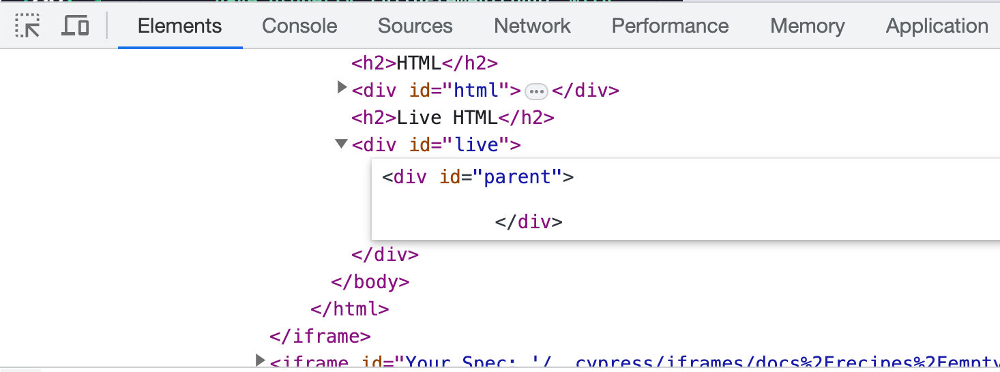

# Empty elements

📺 You can watch this recipe explained in the video [Empty And Non-empty Elements On The Page](https://youtu.be/bwMFsmWM4fM)

## No children

Let's use CSS selector `:empty` to find empty `DIV` elements

<!-- fiddle Empty elements without children or text -->

```html
<div>First</div>
<div>Second</div>
<div></div>
<div>Third</div>
<div>Fourth</div>
<div></div>
```

We have 6 HTML elements.

```js
cy.get('*').should('have.length', 6)
```

```js
cy.get(':empty').should('have.length', 2)
```

Let's find non-empty `DIV` elements

```js
cy.get(':not(:empty)').should('have.length', 4)
```

<!-- fiddle-end -->

## Empty child

Even if there is a single empty child element, the element is _not_ empty. For example, in the HTML below, the parent `DIV` in the `<div><span></span></div>` is NOT empty, while the `SPAN` is empty.

<!-- fiddle Empty child element -->

```html
<div>First</div>
<div>Second</div>
<div><span></span></div>
<div>Third</div>
<div>Fourth</div>
<div></div>
```

We have 7 elements.

```js
cy.get('*').should('have.length', 7)
```

The `SPAN` and the last `DIV` elements are empty

```js
cy.get(':empty').should('have.length', 2)
```

All other elements are not empty

```js
cy.get(':not(:empty)').should('have.length', 5)
```

<!-- fiddle-end -->

## Empty element assertion

An element without children can checked in two ways:

<!-- fiddle Confirm an element is empty -->

```html
<div id="me"></div>
```

```js
cy.get('#me')
  // an element without children
  .should('be.empty')
  // also matches CSS selector ":empty"
  .and('match', ':empty')
```

<!-- fiddle-end -->

## Whitespace with self-closing child

<!-- fiddle Whitespace with self-closing child -->

Notice that even though the parent element has no children (the child element is removed), it is still _not empty_.

```html
<div id="parent"><div id="child" /></div>
```

```js app
document.getElementById('child').remove()
```

```js
cy.get('#parent').should('not.be.empty')
```

The removed child element leaves empty space inside the parent HTML element.



Instead of checking completely empty element we can check its properties:

```js
cy.get('#parent').should('have.prop', 'childElementCount', 0)
cy.get('#parent').should('have.prop', 'innerText', '')
```

<!-- fiddle-end -->

## Whitespace with closing tag child

<!-- fiddle Whitespace with closing tag child -->

This child element has the explicit closing tag `<div id="child"></div>`

```html
<div id="parent"><div id="child"></div></div>
```

```js app
document.getElementById('child').remove()
```

Removing this element leaves _no whitespace_ in the parent element.

```js
cy.get('#parent')
  .should('be.empty')
  .and('have.prop', 'childElementCount', 0)
  .and('have.prop', 'innerText', '')
```

<!-- fiddle-end -->

## See also

- [Empty assertions](./empty-assertion.md)
