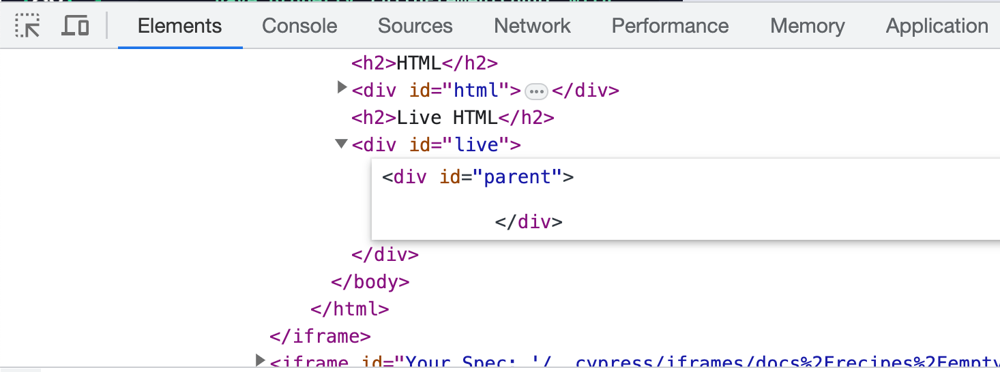

# Empty elements

📺 You can watch this recipe explained in the video [Empty And Non-empty Elements On The Page](https://youtu.be/bwMFsmWM4fM)

## No children

Let's use CSS selector `:empty` to find empty `DIV` elements

<!-- fiddle Empty elements without children or text -->

```html
<div>First</div>
<div>Second</div>
<div></div>
<div>Third</div>
<div>Fourth</div>
<div></div>
```

We have 6 HTML elements.

```js
cy.get('*').should('have.length', 6)
```

```js
cy.get(':empty').should('have.length', 2)
```

Let's find non-empty `DIV` elements

```js
cy.get(':not(:empty)').should('have.length', 4)
```

<!-- fiddle-end -->

## Empty child

Even if there is a single empty child element, the element is _not_ empty. For example, in the HTML below, the parent `DIV` in the `<div><span></span></div>` is NOT empty, while the `SPAN` is empty.

<!-- fiddle Empty child element -->

```html
<div>First</div>
<div>Second</div>
<div><span></span></div>
<div>Third</div>
<div>Fourth</div>
<div></div>
```

We have 7 elements.

```js
cy.get('*').should('have.length', 7)
```

The `SPAN` and the last `DIV` elements are empty

```js
cy.get(':empty').should('have.length', 2)
```

All other elements are not empty

```js
cy.get(':not(:empty)').should('have.length', 5)
```

<!-- fiddle-end -->

## Empty element assertion

An element without children can checked in two ways:

<!-- fiddle Confirm an element is empty -->

```html
<div id="me"></div>
```

```js
cy.get('#me')
  // an element without children
  .should('be.empty')
  // also matches CSS selector ":empty"
  .and('match', ':empty')
```

<!-- fiddle-end -->

## Whitespace with self-closing child

<!-- fiddle Whitespace with self-closing child -->

Notice that even though the parent element has no children (the child element is removed), it is still _not empty_.

```html
<div id="parent"><div id="child" /></div>
```

```js app
document.getElementById('child').remove()
```

```js
cy.get('#parent').should('not.be.empty')
```

The removed child element leaves empty space inside the parent HTML element.



Instead of checking completely empty element we can check its properties:

```js
cy.get('#parent').should('have.prop', 'childElementCount', 0)
cy.get('#parent').should('have.prop', 'innerText', '')
```

<!-- fiddle-end -->

## Whitespace with closing tag child

<!-- fiddle Whitespace with closing tag child -->

This child element has the explicit closing tag `<div id="child"></div>`

```html
<div id="parent"><div id="child"></div></div>
```

```js app
document.getElementById('child').remove()
```

Removing this element leaves _no whitespace_ in the parent element.

```js
cy.get('#parent')
  .should('be.empty')
  .and('have.prop', 'childElementCount', 0)
  .and('have.prop', 'innerText', '')
```

<!-- fiddle-end -->

## Double border

📺 Watch this recipe explained in the video [Empty List Items Should Not Exist](https://youtu.be/pk0C7XUJ208).

Empty elements might show up as a weird "double" border between elements with text. For example:

<!-- fiddle Double border because of empty element -->

```css
ul#items {
  list-style-type: none;
  margin-block-start: 0;
  margin-block-end: 0;
}
ul#items li {
  padding: 0;
  border: 1px solid gray;
}
```

```html
<ul id="items">
  <li>One</li>
  <li></li>
  <li>Three</li>
</ul>
```

Since the second element is missing any text, but `LI` still renders, there is a "thick" border between the first and the last elements. We can confirm that there are empty elements using the following test:

```js
// all element queries like cy.filter
// have a built-in existence assertion
cy.get('#items li').filter(':empty')
// the selectors can be merged into a single cy.get query
cy.get('#items li:empty')
```

We can prevent any empty elements using the explicit assertion

```js skip
cy.get('#items li:empty').should('not.exist')
```

Alternatively, we can detect any elements with short height

```js
cy.get('#items li')
  .filter((k, el) => {
    // "height" property returns a string like "1.52px"
    const height = parseInt(getComputedStyle(el).height)
    return height < 5
  })
  // only one element with suspiciously small height
  .should('have.length', 1)
```

<!-- fiddle-end -->

## Empty elements inside other elements

Sometimes we want to find all elements with _empty_ elements inside. For example, our list of todo items should not have empty labels - each item should have some text. We cannot simply check the emptiness of the todo item element - since there are checkboxes and some other HTML elements with contents. We are only interested in empty `<LABEL>` elements.

<!-- fiddle Find todo items with empty labels -->

```css
#todos {
  li {
    list-style-type: none;
    min-height: 2em;
    line-height: 2em;
    border: 1px solid grey;
    padding-left: 1em;
    input[type='checkbox'] {
      margin-right: 1em;
    }
  }
}
```

```html
<ul id="todos">
  <li id="1">
    <input type="checkbox" /><label>Clean room</label>
  </li>
  <li id="2">
    <input type="checkbox" /><label>Brush teeth</label>
  </li>
  <li id="3"><input type="checkbox" /><label></label></li>
  <li id="4">
    <input type="checkbox" /><label>Prepare dinner</label>
  </li>
</ul>
```

The app shows a list of chores, but one of the items has no text! None of `<LI>` elements is empty, as the next command proves.

```js
cy.get('#todos li:empty').should('not.exist')
```

Instead we can detect `<LI>` elements that contain children `<LABEL>` elements that are empty

```js
// a single LI element with an empty label inside
cy.get('#todos li:has(label:empty)')
  .should('have.length', 1)
  // confirm we found the right LI element
  .and('have.attr', 'id', '3')
  // or we can check the index of the found LI element
  // amongst all LI siblings
  .invoke('index')
  // indices start with 0
  .should('equal', 2)
```

**Note:** jQuery pseudo-selector `:contains(text)` does not work well with empty strings, since `:contains` returns _partial_ matches. Thus it works the best for non-empty strings.

```js
cy.get('#todos li:has(label:contains("dinner"))').should(
  'have.attr',
  'id',
  '4',
)
```

Let's find all `<LI>` elements with non-empty `<LABEL>` elements inside

```js
cy.get('#todos li:has(label:not(:empty))')
  .should('have.length', 3)
  // confirm we found the right LI elements
  // by looking at their IDs
  .mapInvoke('getAttribute', 'id')
  .should('deep.equal', ['1', '2', '4'])
```

**Note:** the query command `mapInvoke` comes from [cypress-map](https://github.com/bahmutov/cypress-map) plugin.

<!-- fiddle-end -->

## See also

- [Empty assertions](./empty-assertion.md)
- [Empty elements](./empty-elements.md)
