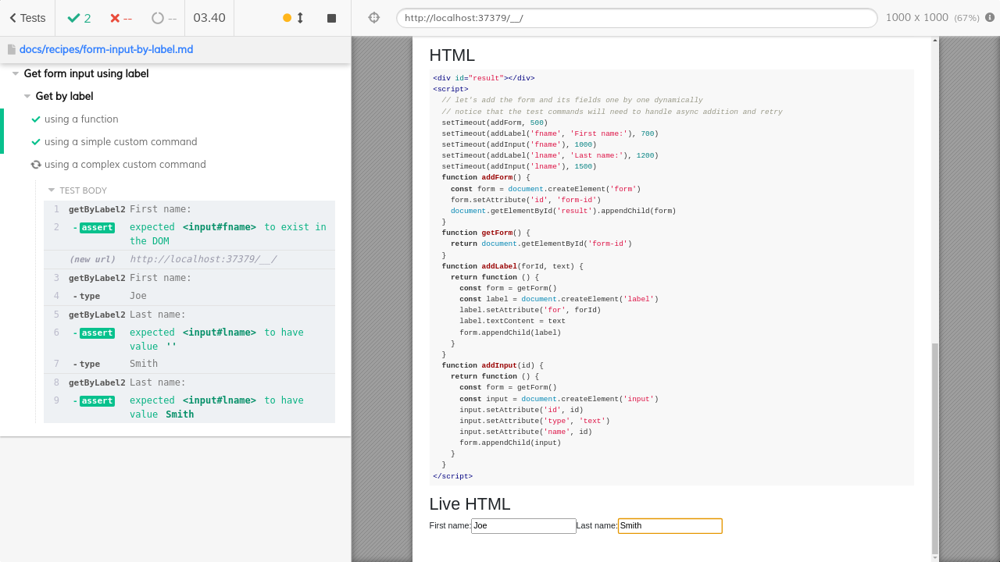

# Get form input using label

Imagine we have a form with an input element and a label. We want to find the input element by label and yield it to further assertions and commands. Let's write a custom command.

## Via parent

If there is a common parent for every label and input pair, we can find the parent element and then find the input.

<!-- fiddle Get by label / via parent form-group -->

```html
<form method="POST" id="signup-form" class="signup-form">
  <div class="form-row">
    <div class="form-group">
      <label for="first_name">First name</label>
      <input
        type="text"
        class="form-input"
        name="first_name"
        id="first_name"
        value="Joe"
      />
    </div>
    <div class="form-group">
      <label for="last_name">Last name</label>
      <input
        type="text"
        class="form-input"
        name="last_name"
        id="last_name"
        value="Smith"
      />
    </div>
  </div>
</form>
```

Find all ".form-group" elements that have inside a label element with the given text

```js
cy.get('.form-group:has(label:contains("First name"))')
  .find('input')
  .should('have.value', 'Joe')
  .and('id', 'first_name')
```

We can grab all form groups with the label inside

```js
cy.get('.form-group:has(label)').should('have.length', 2)
```

<!-- fiddle-end -->

## Reusable function

<!-- fiddle Get by label / using a function -->

Form with several input text fields and their labels

```html
<form>
  <label for="fname">First name:</label><br />
  <input type="text" id="fname" name="fname" /><br />
  <label for="lname">Last name:</label><br />
  <input type="text" id="lname" name="lname" />
</form>
```

```js
// we can find the input field by id and name using the standard cy.get
cy.get('#fname').should('have.attr', 'type', 'text')
cy.get('input[name=fname]').should('have.attr', 'id', 'fname')
```

we can find the label by text, grab its "for" attribute, and then find the input element. To find the label by text we can use [cy.contains](https://on.cypress.io/contains)

```js
cy.contains('label', 'First name:')
  .invoke('attr', 'for')
  .should('equal', 'fname')
  .then((id) => {
    // note that the last Cypress command inside the `cy.then`
    // changes the yielded subject to its result
    cy.get('#' + id)
  })
  .should('have.attr', 'name', 'fname')
```

The above code can be abstracted into a little reusable function

```js
// we return the Cypress chain so the test can attach more commands
const getInputByLabel = (label) => {
  return cy
    .contains('label', label)
    .invoke('attr', 'for')
    .then((id) => {
      cy.get('#' + id)
    })
}
// let's type the last name
getInputByLabel('Last name:').type('Smith')
// we can also check the value
getInputByLabel('Last name:').should('have.value', 'Smith')
```

<!-- fiddle-end -->

## Simple custom command

While making a small reusable function is my preferred way of writing reusable test code, you can also create a custom command.

<!-- fiddle Get by label / using a simple custom command -->

Form with several input text fields and their labels

```html
<form>
  <label for="fname">First name:</label><br />
  <input type="text" id="fname" name="fname" /><br />
  <label for="lname">Last name:</label><br />
  <input type="text" id="lname" name="lname" />
</form>
```

```js
Cypress.Commands.add('getByLabel', (label) => {
  // you can disable individual command logging
  // by passing {log: false} option
  cy.log('**getByLabel**')
  cy.contains('label', label)
    .invoke('attr', 'for')
    .then((id) => {
      cy.get('#' + id)
    })
})
// let's use the custom command to act on the first name
cy.getByLabel('First name:').should('have.value', '').type('Joe')
cy.getByLabel('First name:').should('have.value', 'Joe')
```

<!-- fiddle-end -->

## Simple command failure

The simple custom command only retries the last command `cy.get`. What if the entire part of the document is refreshed, and the `id` value changes? Let's try writing an example for it.

<!-- fiddle.skip Get by label / using a simple custom command FAILS -->

At first, the form has the labels and the input fields, but then the app "hydrates" them, replacing the initial ids with randomly generated ones.

```html
<form id="hydrate-fails">
  <label for="fname">First name:</label><br />
  <input
    type="text"
    id="fname"
    name="fname"
    value="initial"
  /><br />
  <label for="lname">Last name:</label><br />
  <input type="text" id="lname" name="lname" />
</form>
<script>
  function hydrate() {
    const form = document.querySelector('form#hydrate-fails')
    form.innerHTML = `
      <div>Hydrated!</div>
      <label for="fname111">First name:</label><br />
      <input type="text" id="fname111" name="fname111" /><br />
      <label for="lname222">Last name:</label><br />
      <input type="text" id="lname222" name="lname222" />
    `
  }
  setTimeout(hydrate, 1000)
</script>
```

The test below _fails_ to account for this, and keeps trying finding an input element with ID "fname", which never becomes available.

```js
// ⛔️ THIS TEST WILL FAIL
Cypress.Commands.add('getByLabel', (label) => {
  // you can disable individual command logging
  // by passing {log: false} option
  cy.log('**getByLabel**')
  cy.contains('label', label)
    .invoke('attr', 'for')
    .then((id) => {
      cy.get('#' + id)
    })
})
// let's use the custom command to act on the first name
cy.getByLabel('First name:').should('have.value', '').type('Joe')
cy.getByLabel('First name:').should('have.value', 'Joe')
```

<!-- fiddle-end -->

## Complex custom command with retries

Let's make more complex command

<!-- fiddle Get by label / using a complex custom command -->

If the form is initially empty or does not even exist, our custom command has to handle it.

```html
<div id="result"></div>
<script>
  // let's add the form and its fields one by one dynamically
  // notice that the test commands will need to handle async addition and retry
  setTimeout(addForm, 500)
  setTimeout(addLabel('fname', 'First name:'), 700)
  setTimeout(addInput('fname'), 1000)
  setTimeout(addLabel('lname', 'Last name:'), 1200)
  setTimeout(addInput('lname'), 1500)
  function addForm() {
    const form = document.createElement('form')
    form.setAttribute('id', 'form-id')
    document.getElementById('result').appendChild(form)
  }
  function getForm() {
    return document.getElementById('form-id')
  }
  function addLabel(forId, text) {
    return function () {
      const form = getForm()
      const label = document.createElement('label')
      label.setAttribute('for', forId)
      label.textContent = text
      form.appendChild(label)
    }
  }
  function addInput(id) {
    return function () {
      const form = getForm()
      const input = document.createElement('input')
      input.setAttribute('id', id)
      input.setAttribute('type', 'text')
      input.setAttribute('name', id)
      form.appendChild(input)
    }
  }
</script>
```

```js
Cypress.Commands.add('getByLabel2', (label, options = {}) => {
  const log = {
    name: 'getByLabel2',
    message: label,
  }
  Cypress.log(log)

  // returns the document object of the application under test
  const document = cy.state('document')

  // this function just tries to find the element
  // we cannot use Cypress commands - aside from static ones,
  // but we can use normal DOM JavaScript and jQuery methods
  const getValue = () => {
    const $label = Cypress.$(document).find(
      'label:contains("' + label + '")',
    )
    if (!$label.length) {
      return
    }
    const forId = $label.attr('for')
    if (!forId) {
      return
    }
    const input = document.getElementById(forId)
    return input
  }

  const resolveValue = () => {
    return Cypress.Promise.try(getValue).then(($el) => {
      // important: pass a jQuery object to cy.verifyUpcomingAssertions
      if (!Cypress.dom.isJquery($el)) {
        $el = Cypress.$($el)
      }
      return cy.verifyUpcomingAssertions($el, options, {
        onRetry: resolveValue,
      })
    })
  }

  return resolveValue().then((el) => {
    // add console props method, which is invoked
    // when the user clicks on the command
    log.consoleProps = () => {
      return {
        result: el,
      }
    }

    return el
  })
})

// let's use the custom command to act on the first name
cy.getByLabel2('First name:').should('exist')
cy.getByLabel2('First name:').type('Joe')
// now interact with the second input
cy.getByLabel2('Last name:')
  .should('have.value', '')
  .type('Smith')
cy.getByLabel2('Last name:').should('have.value', 'Smith')

cy.takeRunnerPic('form-input')
```

<!-- fiddle-end -->



Let's try the custom command with hydration example

<!-- fiddle Get by label / using a complex custom command with hydration -->

```html
<form id="hydration">
  <label for="fname">First name:</label><br />
  <input
    type="text"
    id="fname"
    name="fname"
    value="initial"
  /><br />
  <label for="lname">Last name:</label><br />
  <input type="text" id="lname" name="lname" />
</form>
<script>
  function hydrate() {
    const form = document.querySelector('form#hydration')
    form.innerHTML = `
      <div>Hydrated!</div>
      <label for="fname111">First name:</label><br />
      <input type="text" id="fname111" name="fname111" /><br />
      <label for="lname222">Last name:</label><br />
      <input type="text" id="lname222" name="lname222" />
    `
  }
  setTimeout(hydrate, 1000)
</script>
```

```js
Cypress.Commands.add('getByLabel2', (label, options = {}) => {
  const log = {
    name: 'getByLabel2',
    message: label,
  }
  Cypress.log(log)

  // returns the document object of the application under test
  const document = cy.state('document')

  // this function just tries to find the element
  // we cannot use Cypress commands - aside from static ones,
  // but we can use normal DOM JavaScript and jQuery methods
  const getValue = () => {
    const $label = Cypress.$(document).find(
      'label:contains("' + label + '")',
    )
    if (!$label.length) {
      return
    }
    const forId = $label.attr('for')
    if (!forId) {
      return
    }
    const input = document.getElementById(forId)
    return input
  }

  const resolveValue = () => {
    return Cypress.Promise.try(getValue).then(($el) => {
      // important: pass a jQuery object to cy.verifyUpcomingAssertions
      if (!Cypress.dom.isJquery($el)) {
        $el = Cypress.$($el)
      }
      return cy.verifyUpcomingAssertions($el, options, {
        onRetry: resolveValue,
      })
    })
  }

  return resolveValue().then((el) => {
    // add console props method, which is invoked
    // when the user clicks on the command
    log.consoleProps = () => {
      return {
        result: el,
      }
    }

    return el
  })
})

cy.getByLabel2('First name:')
  .should('have.value', '')
  .type('Joe')
cy.getByLabel2('First name:').should('have.value', 'Joe')
```

<!-- fiddle-end -->
