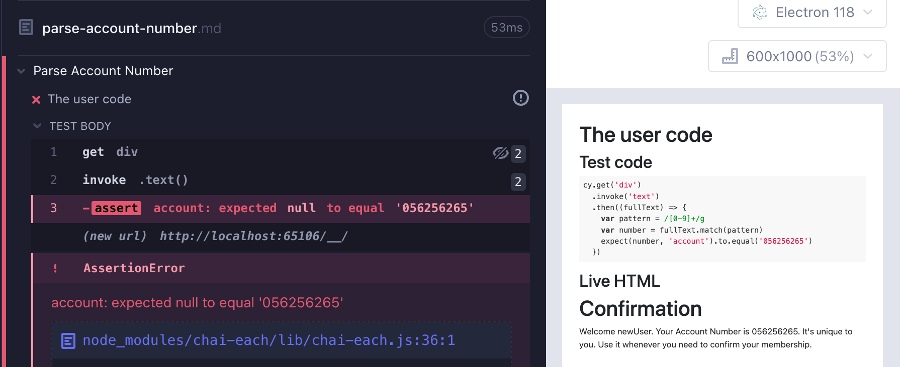
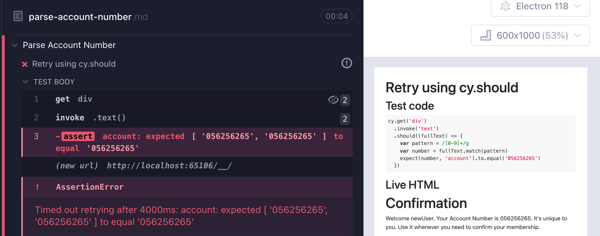
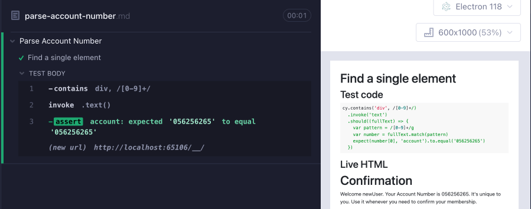

# Parse Account Number

Recently I saw a question on [/r/Cypress](https://www.reddit.com/r/Cypress/): How do I `cy.get` a 9-digit number? The application displays something like this after a delay:

```
Confirmation

Welcome newUser.

Your Account Number is 056256265.

It's unique to you. Use it whenever you need to confirm your membership.
```

## The user code

The user tried to get the number using the following code:

<!-- fiddle.skip The user code -->

```html hide
<div>
  <h1 data-testid="title">Confirmation</h1>
  <div></div>
</div>
<script>
  const div = document.querySelector(
    'h1[data-testid=title] + div',
  )
  setTimeout(() => {
    div.innerText =
      "Welcome newUser. Your Account Number is 056256265. It's unique to you. Use it whenever you need to confirm your membership."
  }, 1000)
</script>
```

```js
cy.get('div')
  .invoke('text')
  .then((fullText) => {
    var pattern = /[0-9]+/g
    var number = fullText.match(pattern)
    expect(number, 'account').to.equal('056256265')
  })
```

<!-- fiddle-end -->



The test fails for two main reasons:

- it grabs multiple `div` elements. We need to limit ourselves to the `div` element with the account number only. Since the page does not provide any [good selectors](../commands/querying.md), we can simply find the `div` element with a 9-digit number using [cy.contains](https://on.cypress.io/contains) with a regular expression.
- the commands do not retry. We simply get the text from the `div` elements and pass it to the [cy.then](https://on.cypress.io/then) command. The callback function runs a regular expression to get the account number. The extracted value (could be `null`) is used inside the expression `expect(number, 'account').to.equal('056256265')`. If the assertion throws, the `cy.then(callback)` fails and the entire test fails.

Imagine we cannot modify the application to give the account its own element selector, like `<span data-testid="account">...</span>`. We can still improve the test.

## Use `cy.should` instead of `cy.then`

Let's make sure the test retries getting all `div` elements if there is no account number. Simply use [cy.should](https://on.cypress.io/should) instead of [cy.then](https://on.cypress.io/then).

<!-- fiddle.skip Retry using cy.should -->

```html hide
<div>
  <h1 data-testid="title">Confirmation</h1>
  <div>
    Welcome newUser. Your Account Number is ... It's unique to
    you. Use it whenever you need to confirm your membership.
  </div>
</div>
<script>
  const div = document.querySelector(
    'h1[data-testid=title] + div',
  )
  setTimeout(() => {
    div.innerText = div.innerText.replace(
      '...',
      '05625' + '6265',
    )
  }, 1000)
</script>
```

```js
cy.get('div')
  .invoke('text')
  .should((fullText) => {
    var pattern = /[0-9]+/g
    var number = fullText.match(pattern)
    expect(number, 'account').to.equal('056256265')
  })
```

<!-- fiddle-end -->

The test retries until the account number shows up, but then fails, since it finds multiple `div` elements and gets both.



We need to limit ourselves to a single element showing the account number.

## Single element

We can find just a single element that has text matching a regular expression using my favorite command [cy.contains](https://on.cypress.io/contains).

<!-- fiddle Find a single element -->

```html hide
<div>
  <h1 data-testid="title">Confirmation</h1>
  <div>
    Welcome newUser. Your Account Number is ... It's unique to
    you. Use it whenever you need to confirm your membership.
  </div>
</div>
<script>
  const div = document.querySelector(
    'h1[data-testid=title] + div',
  )
  setTimeout(() => {
    div.innerText = div.innerText.replace(
      '...',
      '05625' + '6265',
    )
  }, 1000)
</script>
```

```js
cy.contains('div', /[0-9]+/)
  .invoke('text')
  .should((fullText) => {
    var pattern = /[0-9]+/g
    var number = fullText.match(pattern)
    expect(number[0], 'account').to.equal('056256265')
  })
```

<!-- fiddle-end -->



## Cleanup

Let's simplify the test by removing all temporary variables and using a chain of [retry-able](./retry-ability.md) commands.

<!-- fiddle Fluent chain of retry-able commands -->

```html hide
<div>
  <h1 data-testid="title">Confirmation</h1>
  <div>
    Welcome newUser. Your Account Number is ... It's unique to
    you. Use it whenever you need to confirm your membership.
  </div>
</div>
<script>
  const div = document.querySelector(
    'h1[data-testid=title] + div',
  )
  setTimeout(() => {
    div.innerText = div.innerText.replace(
      '...',
      '05625' + '6265',
    )
  }, 1000)
</script>
```

```js
// use named capture group expression
const accountRegex = /(?<account>[0-9]{9})/
cy.contains('div', accountRegex)
  .invoke('text')
  // the current subject is a string
  // and we invoke its method "match"
  // passing the regular expression
  .invoke('match', accountRegex)
  // if the expression matches
  // then it yields an object
  // and we can get the matched value by name
  .its('groups.account')
  // and use an implicit assertion against the subject
  .should('equal', '056256265')
```

<!-- fiddle-end -->

## Recommended

If I could modify the application code, I would give the account number its own element. That would make selecting the element much simpler and would eliminate the regular expression.

<!-- fiddle Recommended markup -->

```html hide
<div>
  <h1 data-testid="title">Confirmation</h1>
  <div>
    Welcome newUser. Your Account Number is
    <span id="acc">...</span> It's unique to you. Use it whenever
    you need to confirm your membership.
  </div>
</div>
<script>
  const el = document.querySelector('#acc')
  setTimeout(() => {
    el.innerText = '05625' + '6265'
  }, 1000)
</script>
```

Our solution could be a single `cy.contains` command.

```js
cy.contains('#acc', '056256265')
```

Or if we need the account number text:

```js
cy.get('#acc').invoke('text').should('equal', '056256265')
```

<!-- fiddle-end -->
