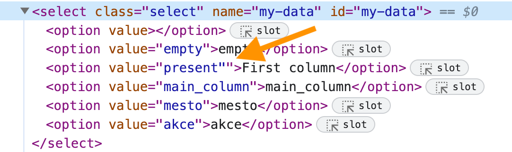

# Selected value

## Option's value

<!-- fiddle Selected value -->

```html
<select>
  <option value="456">apples</option>
  <option value="457">oranges</option>
  <option value="458">bananas</option>
</select>
```

Let's select the option "oranges" and see what value it has. We can use [cy.select](https://on.cypress.io/select) It yields the jQuery for the original `<select>` element.

```js
cy.get('select')
  .select('oranges')
  .should(($el) => {
    expect(Cypress.dom.isElement($el), 'yields DOM element').to
      .be.true
    expect(Cypress.dom.isJquery($el), 'wrapped in jQuery').to.be
      .true
    // note: the yielded element is the <select>
    expect($el.prop('nodeName'), 'element type').to.equal(
      'SELECT',
    )
    expect($el.val(), 'option value').to.equal('457')
  })
// shorter assertion using chaining
cy.get('select')
  .select('oranges')
  .invoke('val')
  .should('equal', '457')
// you can yield the value without retrying
cy.get('select')
  .select('oranges')
  .invoke('val')
  .then((value) => {
    expect(value).to.equal('457')
  })
```

<!-- fiddle-end -->

You can select multiple options, yielding list of elements

<!-- fiddle Selected multiple values -->

```html
<select multiple>
  <option value="456">apples</option>
  <option value="457">oranges</option>
  <option value="458">bananas</option>
</select>
```

```js
cy.get('select')
  .select(['apples', 'bananas']) // yields <select> element
  .invoke('val') // calls $(<select>).val() which returns list of selected values
  .should('deep.equal', ['456', '458'])
```

<!-- fiddle-end -->

## Selecting option by index

<!-- fiddle Select by index -->

Imagine we have a `<select>` element and want to select an option _by index_. Let's say we want to select the option at index 1 and confirm it has text "oranges" and value "457".

```html
<select>
  <option value="456">apples</option>
  <option value="457">oranges</option>
  <option value="458">bananas</option>
</select>
```

```js
// every child of <select> is an <option> element
cy.get('select')
  .children()
  .eq(1)
  .then(($option) => {
    expect(
      $option.prop('label'),
      'cannot compare 🍎 to 🍊',
    ).to.equal('oranges')

    const value = $option.attr('value')
    expect(value).to.equal('457')
    // if we want to select the oranges,
    // let's use the value we got
    cy.get('select').select(value)
  })
// let's confirm the selected option
cy.get('select').invoke('val').should('equal', '457')
```

<!-- fiddle-end -->

## Selecting the random option

<!-- fiddle Select the random option -->

Imagine we have a `<select>` element and want to select one of its options randomly.

```html
<select>
  <option value="456">apples</option>
  <option value="457">oranges</option>
  <option value="458">bananas</option>
</select>
```

```js
// get the number of options available
cy.get('select option')
  .its('length')
  // pick a random number between 0 and n-1
  // using the Lodash _.random function
  .then((n) => Cypress._.random(0, n - 1))
  // print the picked random number
  .should('be.a', 'number')
  // and then use the cy.select command
  // to select it from the element
  .then((index) => {
    cy.get('select').select(index)
  })
// confirm the selected value
cy.get('select')
  .invoke('val')
  .should('be.oneOf', ['456', '457', '458'])
```

<!-- fiddle-end -->

## Select the last option

Similarly, we can select the last option in two steps: first, find the value of the last `<option>` element, then select it in the `<select>` element.

<!-- fiddle Select the last option -->

```html
<select>
  <option value="apl">apples</option>
  <option value="ora">oranges</option>
  <option value="ban">bananas</option>
</select>
```

```js
cy.get('select option')
  .last()
  .invoke('val')
  .then((value) => {
    cy.get('select').select(value)
  })
// verify the last option was selected
cy.get('select').should('have.value', 'ban')
```

<!-- fiddle-end -->

## Verify options text

Let's say we want to verify all available options and confirm their text. The options below should include only "BMW", "Mercedes", and "Audi".

<!-- fiddle Confirm options text -->

```html
<select id="cars_list">
  <option value="-1">--Select Car--</option>
  <option value="B">BMW</option>
  <option value="M">Mercedes</option>
  <option value="A">Audi</option>
</select>
```

The test is verbose on purpose, converting and confirming everything step by step.

```js
cy.get('#cars_list option')
  .then(($options) => {
    // get the text of each option
    return Cypress._.map(
      $options,
      ($option) => $option.innerText,
    )
  })
  .should('deep.equal', [
    '--Select Car--',
    'BMW',
    'Mercedes',
    'Audi',
  ])
  // let's skip the "--Select Car--" default option
  .then((list) =>
    Cypress._.filter(list, (s) => s !== '--Select Car--'),
  )
  // and check now
  .should('deep.equal', ['BMW', 'Mercedes', 'Audi'])
  // TIP: sort the array for consistency
  .invoke('sort')
  .should('deep.equal', ['Audi', 'BMW', 'Mercedes'])
```

<!-- fiddle-end -->

## Get selected option

You can get the currently selected option using the jQuery's [:selected selector](https://api.jquery.com/selected-selector/).

<!-- fiddle Get selected option text -->

```html
<select id="name">
  <option>Joe</option>
  <option>Mary</option>
  <option selected="selected">Peter</option>
</select>
```

```js
cy.get('select#name option:selected').should(
  'have.text',
  'Peter',
)
```

<!-- fiddle-end -->

## Escape value to select

Imagine that the option values come from an external source we cannot control. The values might have characters like double quotes `"` that will make selecting the value difficult. In the example below, the value we want is `present"`. Can we select it?

<!-- fiddle Escape value to select -->

```html
<select class="select" name="my-data" id="my-data">
  <option value=""></option>
  <option value="empty">empty</option>
  <option value='present"'>First column</option>
  <option value="main_column">main_column</option>
  <option value="mesto">mesto</option>
  <option value="akce">akce</option>
</select>
```

Initially the first option is selected

```js
cy.get('#my-data option:selected').should('have.value', '')
```



Let's select the option with the value that has `"` character. We cannot use the standard `cy.select` command since it does not escape the value / text:

```js skip
// 🚨 DOES NOT WORK
// Syntax error, unrecognized expression: option[value="present""]
cy.get('#my-data').select('present"')
```

Notice how the attribute value is quoted by Cypress, yet the value inside has a quote, breaking the string. We need to form the selector ourselves and select the option. We can escape all invalid characters in the text using the `Cypress.$.escapeSelector` function. Then we can mark the option as selected by setting the attribute `selected`.

```js
// select the option ourselves by setting its attribute
const escaped = Cypress.$.escapeSelector('present"')
cy.get(`#my-data option[value=${escaped}]`).invoke(
  'attr',
  'selected',
  'selected',
)
// check the selected value
cy.get('#my-data option:selected').should(
  'have.text',
  'First column',
)
cy.get('#my-data').should('have.value', 'present"')
```

<!-- fiddle-end -->
